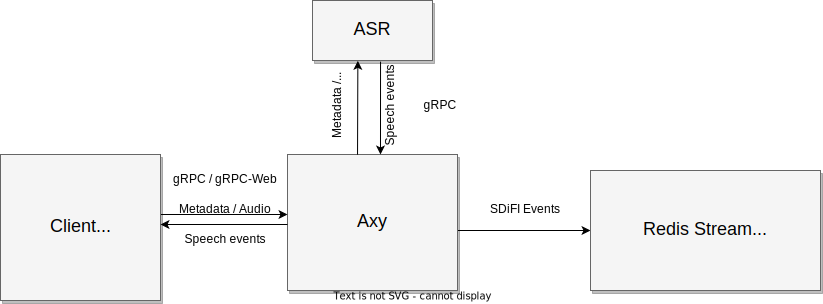

# Axy - Asynchronous proxy for SDiFI

Axy is an asynchronous proxy for automatic speech recognition (ASR). At the
moment it does two things:

- Bidirectional gRPC connection with a conversational client, streaming audio in
  and speech events and partial and final transcripts back to the client.
- Writes these same events to a Redis stream identified by the conversation ID.



Two ASR backends are supported, both using gRPC: [tiro.speech.v1alpha.Speech](https://github.com/tiro-is/tiro-speech-core/blob/master/proto/tiro/speech/v1alpha/speech.proto) 
and [Google Cloud Speech API](https://cloud.google.com/speech-to-text/docs/reference/rpc).

The messages that get written to the Redis Stream have at least two attributes:
`:type` and `:content`. The `:type` attribute is the fully qualified Protobuf
type of an `*Event` described in
[events.proto](https://github.com/SDiFI/protos/blob/d5119598f04ee448c6e5fbff07571353cd3c7c44/sdifi/events/v1alpha/event.proto). E.g. for
a final speech result (i.e. after an endpoint) `:type` would be
`sdifi.events.v1alpha.SpeechFinalEvent`. The `:content` attribute is the
serialized protobuf
[Event](https://github.com/SDiFI/protos/blob/d5119598f04ee448c6e5fbff07571353cd3c7c44/sdifi/events/v1alpha/event.proto#L20).

## Building

### Requirements

- CMake >=3.21
- [Buf](https://buf.build/docs/installation)
- Protobuf (`libprotobuf` and `protoc`)(tested with 3.21.12)
- gRPC++ (and `grpc_cpp_plugin`) >= 1.39.0 (tested with 1.51)
- hiredis >= 0.12.1

On Ubuntu 23.04 these can be installed with:

```shell
sudo apt install libgrpc++-dev protobuf-compiler-grpc libprotobuf-dev \
                 libhiredis-dev cmake
```

Other dependencies are automatically downloaded and built with CMake's
FetchContent. See [deps.cmake](cmake/deps.cmake) for details.

- [redis++](https://github.com/sewenew/redis-plus-plus)
- [nhlomann_json](https://github.com/nlohmann/json)
- [fmtlib](https://github.com/fmtlib/fmt)
- [CLI11](https://github.com/CLIUtils/CLI11)
- [google-cloud-cpp::speech](https://github.com/googleapis/google-cloud-cpp)

### Build with CMake

To build a release build:

```shell
cmake -Bbuild -H. -DCMAKE_BUILD_TYPE=Release -DPREFER_STATIC=ON -GNinja
cmake --build build
```

This will build all targets. The main one is `build/src/axy/axy` which is the
proxy itself.

### Build Docker image

```shell
docker build -t axy .
```

## Running

See options for `axy`.

```
$ build/src/axy/axy -h  # or docker run axy -h

Asynchronous/ASR proxy for SDiFI
Usage: build/src/axy/axy [OPTIONS]

Options:
  -h,--help                   Print this help message and exit
  --version                   Display program version information and exit
  --log-level TEXT:{trace,debug,info,warn,error} [info] 
  --listen-address TEXT [localhost:50051] 
  --backend-speech-server-address TEXT [speech.tiro.is:443] 
                              gRPC server that provides the `tiro.speech.v1alpha.Speech` service. Alternatively, you can set this to `speech.googleapis.com:443` to use Google Cloud Speech. In that case Axy will use Google Application Default Credentials and the evironment variable `GOOGLE_CLOUD_QUOTA_PROJECT` has to be set.
  --backend-speech-server-use-tls
  --redis-address TEXT [tcp://localhost:6379] 
                              The server will write conversation events to streams with keys 'sdifi/conversation/{conv_id}' where {conv_id} is the conversation ID.
  --shutdown-timeout-seconds INT [60s] 
                              Deadline for graceful shutdown.
```
